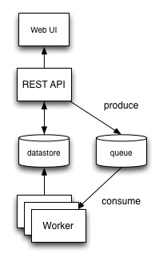

Stevedore
=========

The intent behind this project is to create an easy to use interface for
running arbitrary and presumably long running distributed tasks (or jobs).  It
also provides a framework for executing these arbitrary and distributed
tasks built on top of the [Docker](http://www.docker.io/) containers.

Central Job Manager
===================

* Web UI: Web interface for humans wrapping the REST API
* REST API: Interface for interacting with the CJM
* Datastore: Tracks operational data for tasks run by the CJM
* Queue: Queue of tasks to be executed
* Workers: Light wrapper around Docker container API

How it works
============

1. You first create a docker image locally with the technology of your choice.

2. Register your job by passing the name of your container.  Once the container
image has been downloaded into the local repository, it will be available for
use by the CJM, central job manager.

3. Execute tasks.  Submit the  image to be executed, the number of executions
required for the container image, and any additional parameters.

4.  The CJM keeps track of which container ran, how many executions occurred,
the time it took to execute, and the status of the execution.

API Specification
=================

* GET /task/

* POST /task/

* POST /task/{id}/

* GET /task/{id}/

* GET /result/

* GET /result/{id}/
